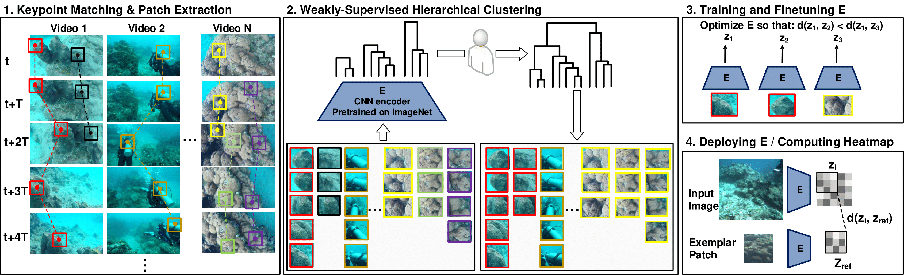

# One-Shot Informed Robotic Visual Search in the Wild

This repository is the official implementation of [One-Shot Informed Robotic Visual Search in the Wild](https://arxiv.org/abs/2003.10010).




## Requirements

#### Dependencies

The project was tested with the following libraries:

- python3 (3.6.9)
- tensorflow-gpu (2.0.0)
- opencv-python (4.1.2.30)
- scipy (1.3.3)
- scikit-image (0.16.2)
- scikit-learn (0.22)

Full requirements are provided in the [**requirements.txt**](requirements.txt) file.

#### Setup

To set up the environment, use the included **requirements.txt** file (preferably inside a virtual environment) like so:

```
    cd PROJECT_ROOT_DIR
    mkdir venv
    virtualenv -p python3 venv
```

To activate and install dependencies in the virtualenv:

```
    source venv/bin/activate
    pip install -r requirements.txt
```

Add the path to your *PYTHONPATH*:

```
    export PYTHONPATH="/path/to/visual_search_in_the_wild:$PYTHONPATH"
```

To deactivate the virtualenv:
```
    deactivate
```


## Datasets

- [Scott Reef 25](http://marine.acfr.usyd.edu.au/datasets/): The dataset is kindly provided by the Australian Centre for Field Robotics' marine robotics group.


## System

#### Extracting patch sequences

To extract patch sequences tracked through ORB feature tracking, use [tracking/extract_similar_sequences.py](tracking/extract_similar_sequences.py).

To extract random patches from a video with uniform-like elements that would not be picked up by traditional feature tracking (e.g: sand), use [tracking/extract_random_patches.py](tracking/extract_random_patches.py).

To visualize the patch sequences you created, use [utils/load_patches.py](utils/load_patches.py).


#### Clustering
To cluster patch sequences using agglomerative clustering, run the following:

```cluster
    python clustering/cluster_sequences.py -p /path/to/patch/sequences -o OUTPUT_DIR
```

To merge clusters manually into a final clustered dataset (or fully curate), run:

```merge
    python utils/patch_curator_annotator.py -p /path/to/clusters/ -o OUTPUT_DIR
```

#### Training

To train the siamese model from scratch, run this command:

```train
    python network/train_triplet.py -p /path/to/list_of_feats_tracked_dirs.txt /path/to/list_of_randomly_extracted_dirs.txt -e 1 0 -d scott
```

To finetune the siamese model using imagenet weights, run this command:

```train
    python network/train_triplet.py -p /path/to/list_of_feats_tracked_dirs.txt /path/to/list_of_randomly_extracted_dirs.txt -e 1 0 -d scott -i
```

The path provided should contain a list of directories that contain a patches folder with patches sequences. This folder structure should be created properly if the patch sequences are extracted using the scripts from the *Extracting patch sequences* section above. An example list is included in the repo as a reference.

#### Testing

To test the model on a video and display a heatmap given a directory of one or more exemplars:

On weights trained from scratch:
```test
    python network/test_triplet.py -r /path/to/exemplar/folder/ -q /path/to/video/or/image_dir/ -v -w WEIGHTS
```

On weights finetuned on imagenet:
```test
    python network/test_triplet.py -r /path/to/exemplar/folder/ -q /path/to/video/or/image_dir/ -v -ft -w WEIGHTS
```

On imagenet weights:
```test
    python network/test_triplet.py -r /path/to/exemplar/folder/ -q /path/to/video/or/image_dir/ -v -i
```

#### Evaluation

To run a similar vs different classification evaluation on patch triplets, run:

```eval
    python network/evaluate_triplet.py -p /path/to/list_of_feats_tracked_test_dirs.txt -e 1 -d scott
```

The same arguments as in the previous *Testing* section can be used for evaluating on scratch, finetuned, or imagenet models (-ft/-i).

Note: to run on CPU, add *CUDA_VISIBLE_DEVICES=-1* before the provided commands.

To evaluate the model's clustering performance on a classification dataset at EVAL_DIR using N exemplars per class from EXEMPLAR_DIR:
```
    python clustering/test_clustering.py -r EXEMPLAR_DIR -d EVAL_DIR -o OUTPUT_DIR -rpn N
```
The above script will save the clustered patches at OUTPUT_DIR and display a classification report.


#### Pre-trained Models

Coming soon.

## Citation

If you find this work or code helpful in your research, please cite:

````
@misc{koreitem2020oneshot,
    title={One-Shot Informed Robotic Visual Search in the Wild},
    author={Karim Koreitem and Florian Shkurti and Travis Manderson and Wei-Di Chang and Juan Camilo Gamboa Higuera and Gregory Dudek},
    year={2020},
    eprint={2003.10010},
    archivePrefix={arXiv},
    primaryClass={cs.RO}
}
````

## Acknowledgment

The authors would like to acknowledge financial support from the Natural Sciences and Engineering Research Council (NSERC) of Canada. The authors would also like to acknowledge the Australian National Research Program (NERP) Marine Biodiversity Hub for the taxonomical labeling and the Australian Centre for Field Robotics for gathering the image data in the Scott Reef 25 dataset.

We relied on the [classification_models](https://github.com/qubvel/classification_models) for the resnet18 base architecture.
